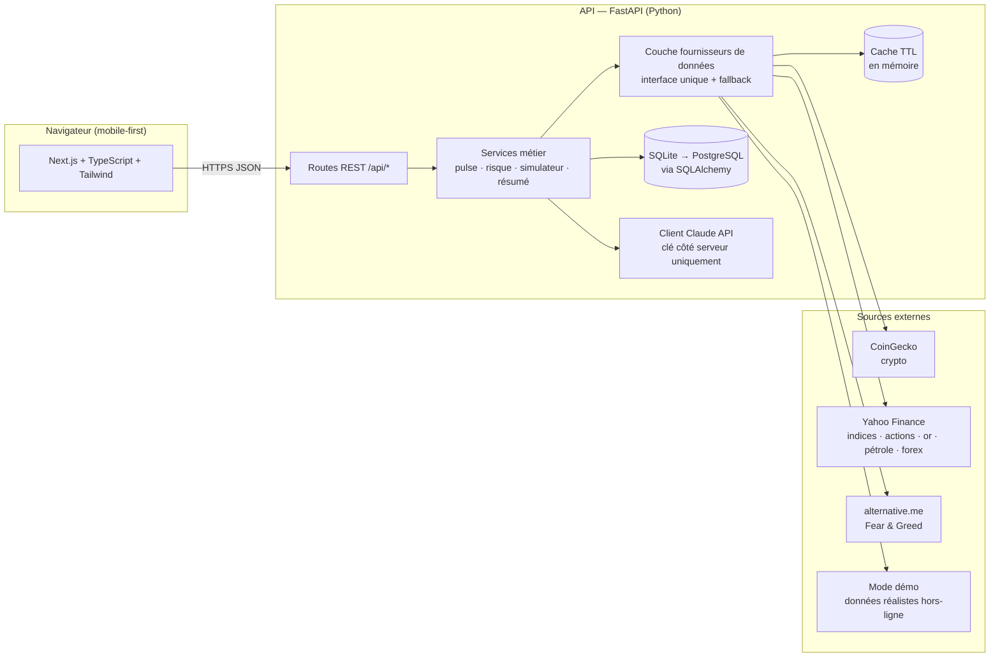

# 3. Architecture technique

> Fil conducteur : **coût ~0 €/mois pour le MVP**, montée en gamme possible sans réécriture.

## 3.1 Vue d'ensemble



## 3.2 Choix techniques et pourquoi (expliqué simplement)

| Brique | Choix MVP | Pourquoi ce choix pour toi |
|---|---|---|
| Frontend | **Next.js 15 + TypeScript** | Le standard actuel : énorme documentation, hébergement gratuit (Vercel), TypeScript t'évite une classe entière de bugs. |
| UI | **Tailwind CSS v4** (+ composants maison) | Gratuit, rapide, dark mode natif. shadcn/ui pourra être ajouté en V2 ; pour le MVP, ~10 composants maison suffisent et tu comprends 100 % de ton code. |
| Graphiques | **lightweight-charts** (TradingView) + SVG maison pour les sparklines | La lib officielle TradingView open source : 45 Ko, gratuite, exactement le rendu « finance » attendu. |
| Backend | **Python 3.11 + FastAPI** | Python = l'écosystème data/finance (pandas, yfinance). FastAPI = rapide à écrire, documentation auto (Swagger), validation Pydantic intégrée. |
| Base de données | **SQLite** en dev, **PostgreSQL** en prod, via **SQLAlchemy** | SQLite = zéro installation, zéro coût, parfait mono-utilisateur. SQLAlchemy fait que passer à PostgreSQL = changer une ligne de configuration, pas réécrire le code. |
| Cache | **TTL en mémoire** (cachetools) → Redis en V2 | Un cache mémoire de 60–300 s divise par ~50 les appels aux APIs gratuites. Redis ne devient utile qu'avec plusieurs processus/serveurs — pas avant la V2. |
| IA | **Claude API**, appelée uniquement par le backend | Deux usages : résumés (modèle rapide/économique type Haiku) et copilote (modèle plus capable type Sonnet). La clé n'atteint JAMAIS le navigateur. Sans clé, l'app fonctionne avec des résumés déterministes générés par des règles. |
| Tâches planifiées | **APScheduler** dans le process FastAPI | Rafraîchissement périodique des cours. Celery/worker séparé = complexité inutile avant la V2. |
| Hébergement | Vercel (front, gratuit) + Railway/Render/Fly (API, 0–5 €/mois) | Le front statique est gratuit à vie ; seule l'API coûte potentiellement quelques euros. En dev : tout tourne sur ton laptop. |

## 3.3 La couche fournisseurs de données (le choix le plus important)

Tu l'as demandé toi-même et c'est LA bonne intuition d'architecture : **aucun service métier ne parle directement à CoinGecko ou Yahoo**. Tout passe par une interface unique :

```python
class MarketDataProvider(Protocol):
    def get_quotes(self, symbols: list[str]) -> list[Quote]: ...
    def get_history(self, symbol: str, days: int) -> list[Candle]: ...
```

Chaque `Quote` transporte **sa source et son horodatage** (`source="coingecko"`, `as_of=…`) — c'est ce qui permet d'afficher « source + fraîcheur » partout dans l'UI sans effort supplémentaire.

Bénéfices concrets :
1. **Changer d'API = écrire un fichier**, pas refondre l'app (si Yahoo casse, on branche Stooq ou Twelve Data).
2. **Chaîne de fallback** : CoinGecko → cache périmé (marqué « données anciennes ») → mode démo. L'app ne montre jamais une page blanche.
3. **Mode démo** : un fournisseur `DemoProvider` génère des données réalistes déterministes. L'app entière (et ses tests) tourne sans réseau ni clé API — indispensable pour développer sereinement et pour la CI.

## 3.4 Règles de circulation des données IA (garde-fous techniques)

1. Le LLM ne reçoit **que** : le snapshot de données du moment (chiffres, sources, horodatages) + la question + un system prompt qui interdit recommandations personnalisées et promesses de gain.
2. Toute sortie IA est étiquetée dans l'UI : « Résumé généré — interprétation, pas un fait ».
3. Les chiffres affichés dans l'UI viennent **toujours** de l'API de données, jamais du texte du LLM (le LLM commente, il ne fournit pas de valeurs).
4. Réponses du copilote plafonnées (tokens) + cache des résumés quotidiens → coût LLM prévisible (< 5 €/mois en usage personnel, ~0 € sans clé).

## 3.5 Sécurité (niveau MVP, base saine pour la suite)

- Clés API uniquement dans `.env` côté serveur ; `.env` dans `.gitignore` ; `.env.example` documenté.
- Validation stricte de toutes les entrées (Pydantic) — montants, symboles, quantités.
- CORS restreint à l'origine du frontend.
- Rate limiting maison (fenêtre glissante) sur l'endpoint copilote dès le MVP — protège le budget LLM ; à généraliser (slowapi) en V2.
- SQLAlchemy = requêtes paramétrées (pas d'injection SQL).
- Le MVP est **mono-utilisateur sans authentification, en local**. L'authentification (et le chiffrement des données de portefeuille) arrive en V2 **avant** tout déploiement public multi-utilisateur.

## 3.6 Structure du monorepo

```
Chedi/
├── docs/                  # ces documents
├── apps/
│   ├── api/               # FastAPI
│   │   ├── app/
│   │   │   ├── main.py            # création de l'app, CORS, routers
│   │   │   ├── config.py          # settings (.env), DEMO_MODE
│   │   │   ├── db.py              # SQLAlchemy (SQLite par défaut)
│   │   │   ├── models.py          # tables (positions, watchlist…)
│   │   │   ├── schemas.py         # DTOs Pydantic
│   │   │   ├── providers/         # coingecko · yahoo · feargreed · demo
│   │   │   ├── services/          # market_data · market · pulse · risk · simulator · assets · summary · copilot
│   │   │   ├── routers/           # /market /assets /portfolio /watchlist /simulator /copilot
│   │   │   └── data/              # univers d'actifs (universe.json)
│   │   └── tests/                 # pytest
│   └── web/               # Next.js (app router)
│       └── src/
│           ├── app/               # pages : dashboard, marches, actif/[s], portefeuille, simulateur, watchlist, apprendre, assistant
│           ├── components/        # tuiles marché, jauge pulse, sparklines, donut, tooltips pédagogiques…
│           └── lib/               # client API typé, formatteurs, glossaire FR, palette validée
├── .env.example
└── README.md
```

Prochain document : [04 — APIs et sources de données](04-apis-donnees.md)
