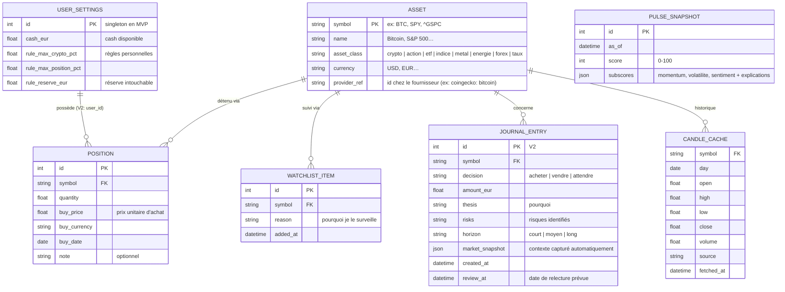

# 5. Modèle de données

> SQLite en dev, PostgreSQL en prod — même schéma via SQLAlchemy.
> Règle : on ne stocke durablement que ce qui t'appartient (portefeuille, watchlist, journal).
> Les cours de marché sont du **cache**, jamais la source de vérité.

## 5.1 Schéma (MVP + V2 anticipée)

## 5.2 Décisions de conception expliquées

- **`ASSET` est un référentiel statique versionné dans le code** (fichier `universe.json`) et chargé en base au démarrage. Le MVP couvre ~40 actifs (indices majeurs, BTC/ETH + top cryptos, or/argent, pétrole, EUR/USD, quelques ETF et actions phares). Ajouter un actif = une ligne de JSON. La recherche "universelle" du MVP cherche dans ce référentiel ; l'ouverture à tout ticker arbitraire est un chantier V2 (validation, mapping multi-fournisseurs).
- **`provider_ref` par actif** : le même actif a des identifiants différents selon les fournisseurs (`BTC` chez nous = `bitcoin` chez CoinGecko = `BTC-USD` chez Yahoo). Ce mapping vit dans le référentiel, pas dans le code.
- **`CANDLE_CACHE` avec `source` + `fetched_at`** : chaque donnée sait d'où elle vient et quand — c'est ce qui alimente l'affichage « source · fraîcheur » et le futur score de qualité des données (§17). Un cache périmé reste affichable, mais étiqueté comme tel.
- **`market_snapshot` en JSON dans le journal** : au moment d'une décision on fige le contexte (prix, VIX, pulse, variations). Le JSON évite 15 colonnes rigides pour une donnée purement archivistique.
- **`USER_SETTINGS` singleton** : le MVP est mono-utilisateur. En V2, on ajoute une table `users` et une colonne `user_id` sur les tables possessives — migration simple prévue dès maintenant (d'où l'intérêt de SQLAlchemy + Alembic).
- **Pas de table `alerts` ni `news` en MVP** : elles arrivent en V2 avec leurs features. Concevoir des tables pour du code qui n'existe pas = dette morte.
- **Les montants sont stockés dans la devise d'origine + convertis à l'affichage** (taux EUR/USD du jour, source affichée). Stocker des montants pré-convertis figerait un taux de change invisible — source classique d'écarts inexplicables.

## 5.3 Ce qui ne va PAS en base

| Donnée | Où elle vit | Pourquoi |
|---|---|---|
| Cours instantanés | Cache mémoire TTL 60–300 s | Volatile, re-demandable, sans valeur historique propre |
| Glossaire pédagogique | Fichier JSON versionné dans le repo | C'est du contenu éditorial : relu, diffé, corrigé via git |
| Univers d'actifs | Fichier JSON versionné | Idem — et le mapping fournisseurs doit être revu par un humain |
| Clés API | `.env` serveur uniquement | Jamais en base, jamais dans le repo, jamais dans le navigateur |

Prochain document : [06 — Pages et UX](06-ux-pages.md)
